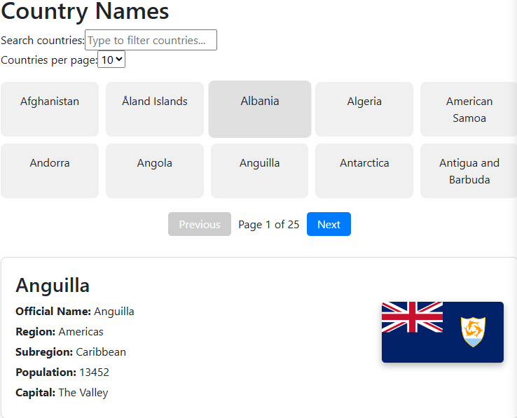
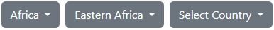
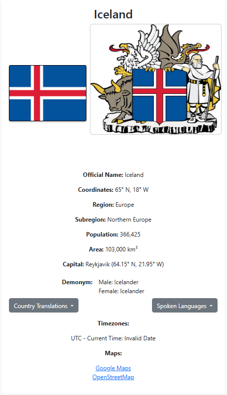
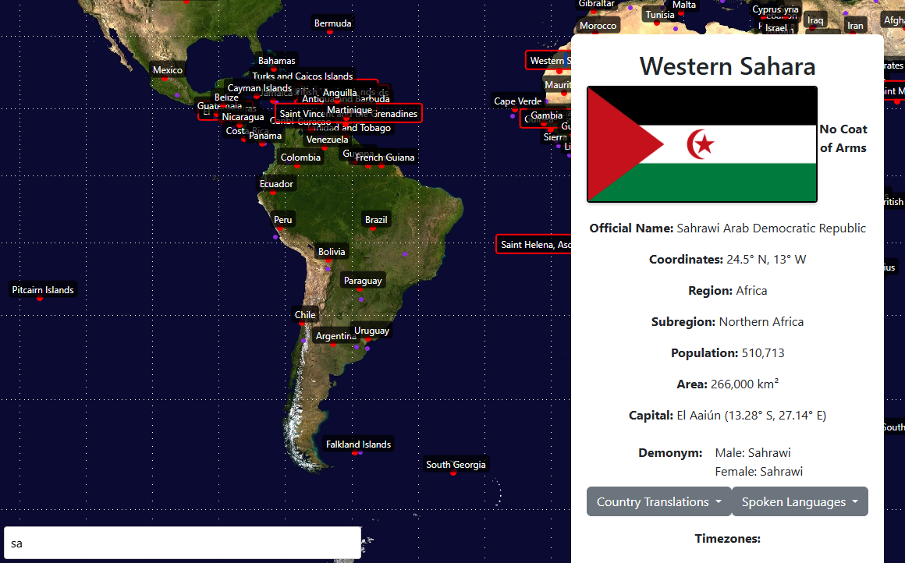

# Countries

This project was generated with [Angular CLI](https://github.com/angular/angular-cli) version 18.2.8 using data retrieved from [REST Countries](https://restcountries.com/). 
It is designed to provide users with a comprehensive and engaging experience for exploring countries around the world. 
The project features an interactive list of country names that can be filtered and paginated for easier navigation. 

Users can select a region and subregion through dropdown menus to narrow down their country choices, leading to detailed information displayed in a dedicated country information page. 
This page showcases essential details such as the country's name, flag, coat of arms, official name, geographical coordinates, region, population, area, capital city, and demonyms, along with translations and spoken languages. 

Additionally, it includes an interactive Earth map that dynamically populates country and capital locations using clickable dots, enhancing the visual experience. 
With search functionalities and overlays for country details, this project offers a user-friendly interface for discovering and learning about global geography.

# Country Explorer

This page offers an interactive list of country names with various features. Users can filter countries by name in real-time using the search input. 
Additionally, pagination controls allow users to choose how many countries are displayed per page and navigate through the list with "Previous" and "Next" buttons. 
By clicking on a country name, users can access detailed information about that specific country.

# Country Selection Page

This page allows users to select a region, subregion, and specific country using dropdown menus. 
Users start by choosing a region from the first dropdown, which displays a list of available options. 
After selecting a region, a second dropdown appears for choosing a subregion within that region. 
Once the subregion is selected, a third dropdown provides a list of countries within it. 
Clicking on a country reveals detailed information supplied by a child component that receives the selected country data.

# Country Information Page

This page offers a comprehensive view of a selected country's information, including its common name as a header, the flag with a link to a full-size image, and the coat of arms if available. 
It displays the official name, geographical coordinates (latitude and longitude), and the country’s region and subregion. 
Additional details include the population, area in square kilometers, capital city with coordinates if applicable, and the demonym for residents. 
Users can access translations of the country name in multiple languages, a list of spoken languages with their codes, current timezones, and links to Google Maps and OpenStreetMap for navigation.

# Interactive Earth Map

This page presents an interactive map of Earth featuring dynamically populated locations for countries and their capitals. 
Users can utilize the search box to find specific countries, with labels highlighted as they type. 
Country locations are marked by dots, each labeled with the respective country name, while purple dots indicate the locations of capital cities for added context. 
When a user selects a country, an overlay appears to provide detailed information about that country.

